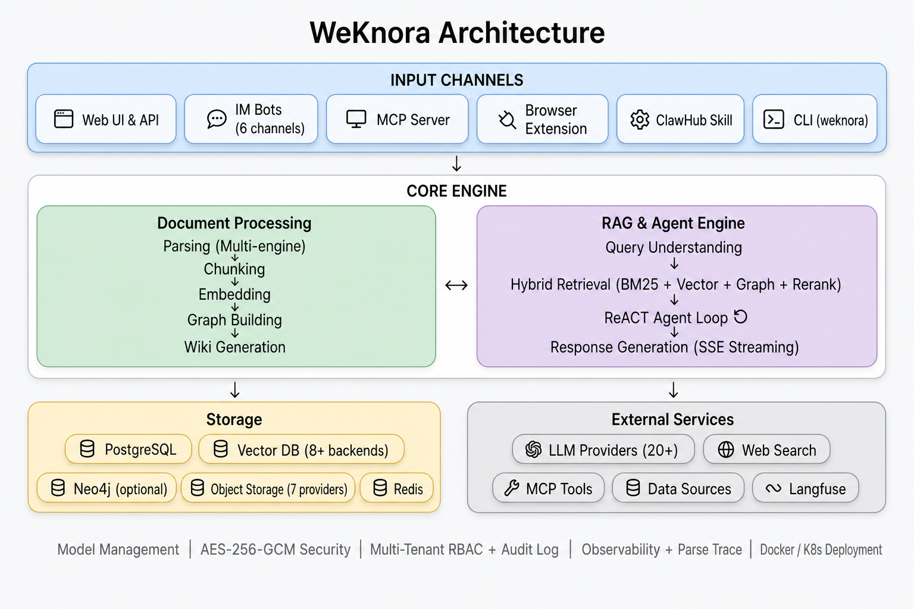

<p align="center">
  <picture>
    
  </picture>
</p>

<p align="center">
  <picture>
    <a href="https://trendshift.io/repositories/15289" target="_blank">
      
    </a>
  </picture>
</p>
<p align="center">
    <a href="https://weknora.weixin.qq.com" target="_blank">
        
    </a>
    <a href="https://chatbot.weixin.qq.com" target="_blank">
        
    </a>
    <a href="https://chromewebstore.google.com/detail/jpemjbopikggjlmikmclgbmkhhopjdgd" target="_blank">
        
    </a>
    <a href="https://clawhub.ai/lyingbug/weknora" target="_blank">
        
    </a>
    <a href="https://github.com/Tencent/WeKnora/blob/main/LICENSE">
        
    </a>
    <a href="./CHANGELOG.md">
        
    </a>
</p>

<p align="center">
| <b>English</b> | <a href="./README_CN.md"><b>简体中文</b></a> | <a href="./README_JA.md"><b>日本語</b></a> | <a href="./README_KO.md"><b>한국어</b></a> |
</p>

<p align="center">
  <h4 align="center">

  [Overview](#-overview) • [Architecture](#-architecture) • [Key Features](#-key-features) • [Getting Started](#-getting-started) • [API Reference](#-api-reference) • [Developer Guide](#-developer-guide)
  
  </h4>
</p>

# 💡 WeKnora — Turn Documents into Living Knowledge with RAG, Agents and Auto-Wiki

## 📌 Overview

[**WeKnora**](https://weknora.weixin.qq.com) is an open-source, LLM-powered knowledge framework built for enterprise-grade document understanding, semantic retrieval, and autonomous reasoning.

It is organized around three core capabilities: **RAG-based Quick Q&A** for everyday lookups, a **ReAct Agent** that autonomously orchestrates retrieval, MCP tools and web search to handle complex multi-step tasks, and a brand-new **Wiki Mode** in which agents distill raw documents into a self-maintaining, interlinked markdown knowledge base with an interactive knowledge graph. Combined with multi-source ingestion (Feishu / Notion / Yuque, and growing), 20+ LLM provider integrations, full Langfuse observability, **enterprise-ready multi-tenant RBAC** (4-tier role matrix + per-resource ownership + per-tenant audit log), and a fully self-hostable modular architecture, WeKnora turns scattered documents into a queryable, reasoning-capable, continuously evolving knowledge asset.

The framework supports auto-syncing knowledge from Feishu, Notion, and Yuque (more data sources coming soon), handles 10+ document formats including PDF, Word, images, and Excel, and can serve Q&A directly through IM channels like WeCom, Feishu, Slack, and Telegram. It is compatible with major LLM providers including OpenAI, DeepSeek, Qwen (Alibaba Cloud), Zhipu, Hunyuan, Gemini, MiniMax, NVIDIA, and Ollama. Its fully modular design allows swapping LLMs, vector databases, and storage backends, with support for local and private cloud deployment ensuring complete data sovereignty. WeKnora also integrates with **Langfuse** for comprehensive observability into agent reasoning, token usage, and pipeline tracing.


## ✨ Latest Updates

- **v0.6.1** — Document parsing trace timeline (Langfuse-style span tree with stage-by-stage progress + stop-parse); OpenSearch vector store driver; declarative built-in models via YAML; system admin & consolidated platform settings + audit log; new-user onboarding guide; settings UI redesign; `weknora` CLI v0.7 / v0.8 (agent-first wire contract, NDJSON, `--dry-run`); OpenDataLoader + PaddleOCR-VL parsers; MCP server multi-transport (stdio / SSE / HTTP); per-model thinking-mode config; Tencent LKEAP rerank + native Gemini embeddings + MiniMax-M3. See [`CHANGELOG.md`](./CHANGELOG.md).
- **v0.6.0** — Tenant RBAC (4-tier role matrix `Owner` / `Admin` / `Contributor` / `Viewer` + per-KB ownership + per-tenant audit log), tenant member management & multi-workspace UX, self-service workspaces; `weknora` CLI v0.4 GA with `mcp serve`; KB retrieval fan-out across vector stores; AES-256-GCM credential encryption + docreader gRPC TLS + Token; Zhipu embedder + Huawei OBS; server-side user preferences; Go 1.26.0. See [`docs/RBAC说明.md`](./docs/RBAC说明.md) and [`CHANGELOG.md`](./CHANGELOG.md).
- **v0.5.2** — Wiki ingest scales to 40k-document KBs (task queue + DLQ); MCP human-in-the-loop tool approval; Anthropic / Apache Doris / Tencent VectorDB / KS3 / SearXNG backends; adaptive 3-tier chunking with live preview; global ⌘K command palette; Yuque connector + WeChat Mini Program; `weknora` CLI preview.
- **v0.5.1** — Knowledge-base batch management; tenant-wide IM channels overview; session search + user-scoped pinning; unified Model / Web Search / MCP settings cards; per-agent LLM timeout; desktop tenant switching.
- **v0.5.0** — Wiki Mode GA — agents auto-generate structured, interlinked Markdown wiki pages with a knowledge graph; wiki browser + visual graph in the UI.
- **v0.4.0** — WeKnora Cloud (hosted LLM + parsing); Chrome Extension; ClawHub Skill; WeChat IM; attachment processing; Azure OpenAI / Alibaba OSS; Notion connector; Baidu + Ollama web search; VectorStore management.
- **v0.3.6** — ASR (audio); Feishu data-source auto-sync; OIDC; IM quote-reply context + thread-based sessions; document summarization; Tavily search; parallel tool calling; agent @mention scope restriction.
- **v0.3.5** — Telegram / DingTalk / Mattermost IM; IM slash commands + QA queue; suggested questions; VLM auto-describe MCP tool images; Novita AI; channel tracking.
- **v0.3.4** — WeCom / Feishu / Slack IM; multimodal image support; NVIDIA model API; Weaviate; AWS S3; AES-256-GCM API-key encryption; built-in MCP service; hybrid-search optimization; `final_answer` tool.
- **v0.3.3** — Parent-child chunking; KB pinning; fallback response; passage cleaning for rerank; storage auto-creation; Milvus.
- **v0.3.2** — Knowledge Search entry; per-source parser & storage engine config; image rendering in local storage; document preview; Volcengine TOS; Mermaid rendering; batch session management; memory graph preview.
- **v0.3.0** — Shared Space; Agent Skills + sandboxed execution; custom agents; Data Analyst agent; thinking mode; Bing / Google web search; API Key auth; Helm chart; Korean i18n; Qdrant.
- **v0.2.0** — Agent Mode (ReACT); multi-type knowledge bases (FAQ + document); conversation strategy config; DuckDuckGo web search; MCP tool integration; new UI with agent mode switching; MQ async task management.


## 📱 Interface Showcase

<table>
  <tr>
    <td colspan="2" align="center"><b>💬 Intelligent Q&A Conversation</b><br/></td>
  </tr>
  <tr>
    <td width="50%" align="center"><b>📖 Wiki Browser</b><br/></td>
    <td width="50%" align="center"><b>🕸️ Wiki Knowledge Graph</b><br/></td>
  </tr>
  <tr>
    <td width="50%" align="center"><b>🤖 Agent Mode · Tool Call Process</b><br/></td>
    <td width="50%" align="center"><b>⚙️ Conversation Settings</b><br/></td>
  </tr>
  <tr>
    <td colspan="2" align="center"><b>🔭 Observability · Langfuse Tracing</b><br/></td>
  </tr>
</table>

## 🏗️ Architecture



Fully modular pipeline from document parsing, vectorization, and retrieval to LLM inference — every component is swappable and extensible. Supports local / private cloud deployment with full data sovereignty and a zero-barrier Web UI for quick onboarding.

## 🧩 Feature Overview

**Intelligent Conversation**

| Capability | Details |
|------------|---------|
| Intelligent Reasoning | ReACT progressive multi-step reasoning, autonomously orchestrating knowledge retrieval, MCP tools, and web search; custom agent support |
| Quick Q&A | RAG-based Q&A over knowledge bases for fast and accurate answers |
| Wiki Mode | Agent-driven auto-generation of structured, interlinked markdown Wiki pages from raw documents |
| Tool Calling | Built-in tools, MCP tools, web search |
| Conversation Strategy | Online Prompt editing, retrieval threshold tuning, multi-turn context awareness |
| Suggested Questions | Auto-generated question suggestions based on knowledge base content |

**Knowledge Management**

| Capability | Details |
|------------|---------|
| Knowledge Base Types | FAQ / Document / Wiki with folder import, URL import, tag management, and online entry |
| Data Source Import | Auto-sync from Feishu / Notion / Yuque (more data sources coming soon); incremental and full sync |
| Document Formats | PDF / Word / Txt / Markdown / HTML / Images / CSV / Excel / PPT / JSON |
| Retrieval Strategies | BM25 sparse / Dense retrieval / GraphRAG / parent-child chunking / multi-dimensional indexing |
| E2E Testing | Full-pipeline visualization with recall hit rate, BLEU / ROUGE metric evaluation |

**Integrations & Extensions**

| Capability | Details |
|------------|---------|
| LLMs | OpenAI / Azure OpenAI / Anthropic (Claude) / DeepSeek / Qwen (Alibaba Cloud) / Zhipu / Hunyuan / Doubao (Volcengine) / Gemini / MiniMax / NVIDIA / Novita AI / SiliconFlow / OpenRouter / Ollama |
| Embeddings | Ollama / BGE / GTE / Zhipu / OpenAI-compatible APIs |
| Vector DBs | PostgreSQL (pgvector) / Elasticsearch / OpenSearch / Milvus / Weaviate / Qdrant / Apache Doris / Tencent VectorDB |
| Object Storage | Local / MinIO / AWS S3 / Volcengine TOS / Alibaba Cloud OSS / Kingsoft Cloud KS3 / Huawei Cloud OBS |
| IM Channels | WeCom / Feishu / Slack / Telegram / DingTalk / Mattermost / WeChat |
| Web Search | DuckDuckGo / Bing / Google / Tavily / Baidu / Ollama / SearXNG |

**Platform**

| Capability | Details |
|------------|---------|
| Deployment | Local / Docker / Kubernetes (Helm) with private and offline support |
| UI | Web UI / RESTful API / CLI (`weknora`) / Chrome Extension / WeChat Mini Program |
| Access Control | Tenant RBAC with 4-tier role matrix (Owner / Admin / Contributor / Viewer), per-KB resource ownership, per-tenant audit log, invite-only workspaces, self-service tenant creation, cross-tenant superuser |
| Security | AES-256-GCM at-rest encryption for API keys and MCP / data-source credentials with graceful key rotation; gRPC TLS + Token between app and docreader; SSRF-safe HTTP client; sandbox isolation for agent skills |
| Observability | Integrated Langfuse for ReAct loops, token tracking, tool calls, and pipeline tracing; built-in Langfuse-style document parsing trace timeline with stage-by-stage progress |
| Task Management | MQ async tasks, automatic database migration on version upgrade |
| Model Management | Centralized config, declarative built-in models via YAML, per-knowledge-base model selection, per-model thinking-mode config, multi-tenant built-in model sharing, WeKnora Cloud hosted models and parsing |

## 🧩 Chrome Extension

[**WeKnora Chrome Extension**](https://chromewebstore.google.com/detail/jpemjbopikggjlmikmclgbmkhhopjdgd) lets you capture web content directly into your WeKnora knowledge base. Select text, images, or entire pages in the browser and save them as knowledge entries with one click — no copy-paste or file upload needed.


## 📱 WeChat Mini Program

The [WeKnora Mini Program](./miniprogram/README.md) provides a lightweight mobile client for configuring WeKnora API access, selecting knowledge bases, importing URLs, and asking knowledge chat from WeChat.


## 🦞 ClawHub Skill

[**WeKnora ClawHub Skill**](https://clawhub.ai/lyingbug/weknora) is a WeKnora skill published on the ClawHub platform. Once installed, it enables document import (file / URL / Markdown), hybrid search (vector + keyword) across knowledge bases, and knowledge entry management — all through the WeKnora REST API.

- **Document Import** — Upload files, import web pages, or write Markdown knowledge via the agent
- **Hybrid Search** — Search within or across knowledge bases with vector + keyword retrieval
- **Knowledge Management** — List, browse, edit, and delete knowledge entries programmatically

## ⌨️ Command-Line Interface

`weknora` is the official CLI for driving the API from a terminal or AI agent.
The command surface mirrors `gh` CLI's `<noun> <verb>` convention; output is
human-readable by default and switches to a stable JSON envelope with `--json`.

```bash
weknora auth login --host https://kb.example.com
weknora kb list
weknora link --kb my-knowledge-base    # bind the current directory
weknora doc upload notes.md
weknora chat "summarise the design doc"
```

See [`cli/README.md`](./cli/README.md) for install + 5-minute quickstart
and [`cli/AGENTS.md`](./cli/AGENTS.md) for the operational contract that
AI agents (Claude Code, Cursor, Aider, …) can rely on.

## 🚀 Getting Started

### 🛠 Prerequisites

- [Docker](https://www.docker.com/) & [Docker Compose](https://docs.docker.com/compose/)
- [Git](https://git-scm.com/)

### 📦 Installation & Launch

```bash
git clone https://github.com/Tencent/WeKnora.git
cd WeKnora
cp .env.example .env   # Edit .env as needed, see comments in the file
docker compose up -d   # Start core services
```

Once started, visit **http://localhost** to get started.

> To use a local Ollama model, run `ollama serve > /dev/null 2>&1 &` first.

### 🔧 Optional Services (Docker Compose Profiles)

Add `--profile` flags to enable additional components. Multiple profiles can be combined:

| Profile | Description | Command |
|---------|-------------|---------|
| _(default)_ | Core services | `docker compose up -d` |
| `full` | All features | `docker compose --profile full up -d` |
| `neo4j` | Knowledge Graph (Neo4j) | `docker compose --profile neo4j up -d` |
| `minio` | Object Storage (MinIO) | `docker compose --profile minio up -d` |
| `langfuse` | Tracing (Langfuse) | `docker compose --profile langfuse up -d` |

Combine profiles: `docker compose --profile neo4j --profile minio up -d`

Stop services: `docker compose down`

### 🌐 Service URLs

| Service | URL |
|---------|-----|
| Web UI | `http://localhost` |
| Backend API | `http://localhost:8080` |
| Langfuse Tracing | `http://localhost:3000` |

## MCP Server

Please refer to the [MCP Configuration Guide](./mcp-server/MCP_CONFIG.md) for the necessary setup.

## 🔌 Using WeChat Dialog Open Platform

WeKnora serves as the core technology framework for the [WeChat Dialog Open Platform](https://chatbot.weixin.qq.com), providing a more convenient usage approach:

- **Zero-code Deployment**: Simply upload knowledge to quickly deploy intelligent Q&A services within the WeChat ecosystem, achieving an "ask and answer" experience
- **Efficient Question Management**: Support for categorized management of high-frequency questions, with rich data tools to ensure accurate, reliable, and easily maintainable answers
- **WeChat Ecosystem Integration**: Through the WeChat Dialog Open Platform, WeKnora's intelligent Q&A capabilities can be seamlessly integrated into WeChat Official Accounts, Mini Programs, and other WeChat scenarios, enhancing user interaction experiences


## 📘 API Reference

Troubleshooting FAQ: [Troubleshooting FAQ](./docs/QA.md)

Detailed API documentation is available at: [API Docs](./docs/api/README.md)

Product plans and upcoming features: [Roadmap](./docs/ROADMAP.md)

## 🧭 Developer Guide

### ⚡ Fast Development Mode (Recommended)

If you need to frequently modify code, **you don't need to rebuild Docker images every time**! Use fast development mode:

```bash
# Start infrastructure
make dev-start

# Start backend (new terminal)
make dev-app

# Start frontend (new terminal)
make dev-frontend
```

**Development Advantages:**
- ✅ Frontend modifications auto hot-reload (no restart needed)
- ✅ Backend modifications quick restart (5-10 seconds, supports Air hot-reload)
- ✅ No need to rebuild Docker images
- ✅ Support IDE breakpoint debugging

**Detailed Documentation:** [Development Environment Quick Start](./docs/开发指南.md)


## 🤝 Contributing

Welcome to submit [Issues](https://github.com/Tencent/WeKnora/issues) or Pull Requests.

**Process:** Fork → Create branch → Commit changes → Open PR

**Standards:** Format code with `gofmt`, follow [Conventional Commits](https://www.conventionalcommits.org/) (`feat:` / `fix:` / `docs:` / `test:` / `refactor:`)

## 🔒 Security Notice

**Important:** Starting from v0.1.3, WeKnora includes login authentication functionality to enhance system security. For production deployments, we strongly recommend:

- Deploy WeKnora services in internal/private network environments rather than public internet
- Avoid exposing the service directly to public networks to prevent potential information leakage
- Configure proper firewall rules and access controls for your deployment environment
- Regularly update to the latest version for security patches and improvements

## 👥 Contributors

Thanks to these excellent contributors:

[](https://github.com/Tencent/WeKnora/graphs/contributors)

## 📄 License

This project is licensed under the [MIT License](./LICENSE).
You are free to use, modify, and distribute the code with proper attribution.

## 📈 Project Statistics

<a href="https://www.star-history.com/#Tencent/WeKnora&type=date&legend=top-left">
 <picture>
   <source media="(prefers-color-scheme: dark)" srcset="https://api.star-history.com/svg?repos=Tencent/WeKnora&type=date&theme=dark&legend=top-left" />
   <source media="(prefers-color-scheme: light)" srcset="https://api.star-history.com/svg?repos=Tencent/WeKnora&type=date&legend=top-left" />
   
 </picture>
</a>
